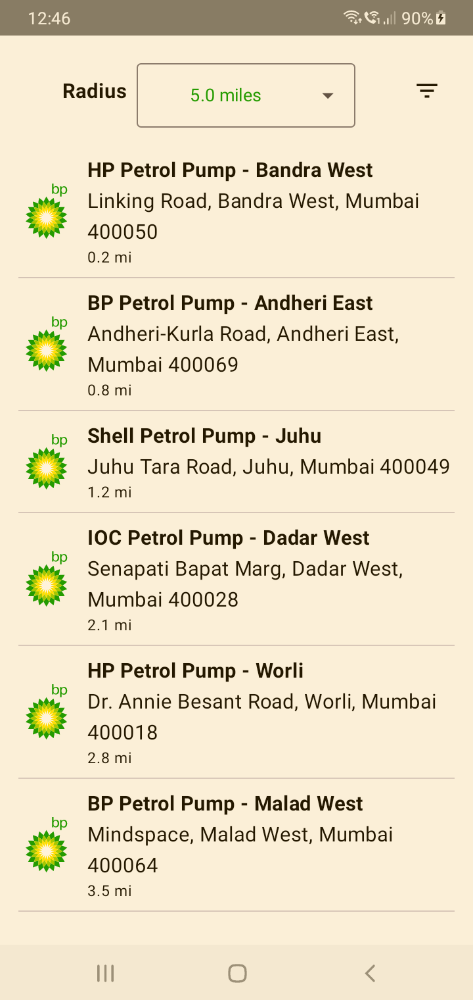
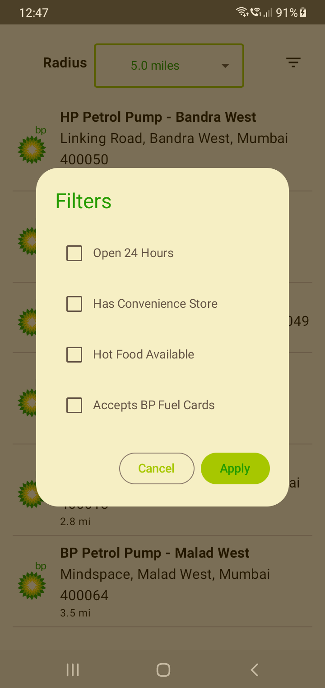
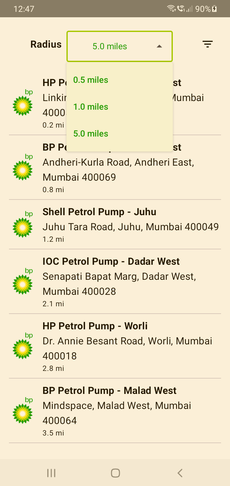

# Home Assignment BP - Service Station Finder

A modern Android application built with Jetpack Compose that helps users find nearby BP service stations with advanced filtering capabilities.

## 🚀 Features

- **Service Station Discovery**: Find BP service stations in your area
- **Advanced Filtering**: Filter stations by multiple criteria:
  - Open 24 hours
  - Convenience store availability
  - Hot food availability
  - BP fuel card acceptance
- **Radius Selection**: Choose search radius (0.5, 1.0, or 5.0 miles)
- **Real-time Data**: Fetches live data from BP service station API
- **Offline Support**: Caches data locally using Room database
- **Modern UI**: Built with Material Design 3 and Jetpack Compose
- **Clean Architecture**: Follows MVVM pattern with proper separation of concerns

## 🏗️ Architecture

This project follows Clean Architecture principles with the following layers:

- **Presentation Layer**: Jetpack Compose UI components and ViewModels
- **Domain Layer**: Business logic and repository interfaces
- **Data Layer**: Repository implementations, API services, and local database
- **DI Layer**: Dependency injection using Hilt

### Tech Stack

- **UI Framework**: Jetpack Compose
- **Architecture Pattern**: MVVM with Clean Architecture
- **Dependency Injection**: Hilt
- **Networking**: Retrofit + GSON
- **Local Database**: Room
- **Image Loading**: Coil
- **Async Programming**: Kotlin Coroutines
- **Testing**: JUnit, MockK, Compose Testing

## 📱 Screenshots





## 🛠️ Setup Instructions

### Prerequisites

- Android Studio Hedgehog or later
- Android SDK 24 or higher
- Kotlin 1.9.0 or higher

### Installation

1. **Clone the repository**
   ```bash
   git clone https://github.com/kiran-mendhe-8/Home-Assignment-BP.git
   cd Home-Assignment-BP
   ```

2. **Open in Android Studio**
   - Open Android Studio
   - Select "Open an existing project"
   - Navigate to the cloned directory and select it

3. **Sync and Build**
   - Wait for Gradle sync to complete
   - Build the project (Build → Make Project)

4. **Run the App**
   - Connect an Android device or start an emulator
   - Click the "Run" button or press Shift+F10

## 📁 Project Structure

```
app/src/main/java/com/mkiran/homeassignment/
├── data/
│   ├── local/           # Room database and DAOs
│   ├── mapper/          # Data mappers
│   ├── remote/          # API services
│   └── repository/      # Repository implementations
├── di/                  # Dependency injection modules
├── domain/
│   ├── model/           # Domain models
│   └── repository/      # Repository interfaces
├── presentation/        # UI components and ViewModels
└── ui/theme/           # Compose theme definitions
```

## 🔧 Key Components

### ServiceStationScreen
The main UI component that displays the list of service stations with filtering capabilities.

### ServiceStationViewModel
Handles business logic, data operations, and UI state management.

### ServiceStationRepository
Abstracts data operations, providing a clean interface for the ViewModel.

### AppDatabase
Room database for local caching of service station data.

## 🧪 Testing

The project includes comprehensive testing:

- **Unit Tests**: ViewModel logic and repository operations
- **UI Tests**: Compose UI component testing
- **Integration Tests**: End-to-end functionality testing

Run tests using:
```bash
./gradlew test          # Unit tests
./gradlew connectedAndroidTest  # Instrumented tests
```

## 📊 Data Flow

1. **API Call**: App fetches service station data from BP API
2. **Local Storage**: Data is cached in Room database
3. **UI Update**: ViewModel updates UI state with fetched data
4. **Filtering**: Users can apply filters to refine results
5. **Real-time Updates**: UI updates immediately when filters change

## 👨‍💻 Author

**Kiran Mendhe**
- GitHub: [@kiran-mendhe-8](https://github.com/kiran-mendhe-8)

---

**Note**: This is a home assignment project demonstrating modern Android development practices with Jetpack Compose and Clean Architecture. 